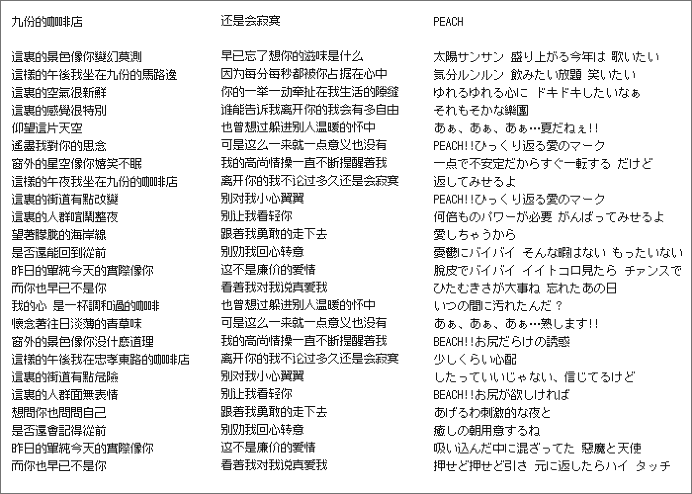

 

Update Log
========

**2016-04-06**
* add outline base on pixel!!! (can be used in any font size now, but it is best to multiples of 12)
* add some full-width characters
* fix some bug

Font Info
========

* Name: Zpix
* Size: 12px (11px + 1px padding)
* Char Total: 21998 (English + Chinese(Simplified) + Chinese(Traditional) + Japanese)

Download
========

* [Download Zpix_1.1_outline.ttf (TureType)](./dist/Zpix_1.1_outline.ttf)
* [Download Zpix_1.1.bdf (BDF)](./src/Zpix_1.1.bdf)

> If you have any questions you can write me a email. `solidzoro(ＡＴ)live.com` .

Buy
========

* for Commercial Product (Multiple Project) `USD $900`
* for Commercial Product (Single Project) `USD $500`
* for Education Project `FREE`
* for Personal Project `FREE`

**My Paypal: `solidzoro(-AT-)live.com`**

> Because spurt in recent purchase, and the font is my work a few years ago, and I will no longer continue to work in the font of So for people who buy the font, I don't have the ability to offer any form of invoice, can't give you any form of written agreement, please understanding.

 
 
 

更新日誌
========

**2016-04-06**
* 添加 生成了一套與像素字體一樣的矢量輪廓！（現在可以在任何字體大小下使用了，不過最好是 12 的倍數）
* 添加 一些等寬字體
* 修復 一些 bug

字體資訊
========

* 名稱：最像素
* 字號：12px （11px + 1px間距）
* 字數：21998個 （英文＋繁體中文＋簡體中文＋日文）

獲取
========

* [下载 Zpix_1.1_outline.ttf (TureType)](./dist/Zpix_1.1_outline.ttf)
* [下载 Zpix_1.1.bdf (BDF)](./src/Zpix_1.1.bdf)

如有疑問可以聯繫 `SolidZORO(ＡＴ)live.com` 。

購買
========

* 用於商業產品（一個產品以上） `RMB ￥3000`
* 用於商業產品 （單產品） `RMB ￥2000`
* 用於教育項目 `免費`
* 用於個人項目 `免費`

**我的支付寶： `solidzoro(-AT-)live.com`**

> 由於近期購買人數突增，且該字體已是我幾年前的作品，另外我也不再繼續從事字體方面的工作。所以對於購買字體的人，我沒有能力開出任何形式的發票，也不能給你們任何形式書面上的協議，請諒解。
點擊上面鏈接即可進行購買，如需選擇商業單項目使用，可以購買後讓我改價格。我會在看到支付信息後主動與你聯繫，並把字體源文件Email給你。

版權聲明
========

[最像素] 為 SolidZORO 具有完全自主智慧財產權的產品，受《中華人民共和國著作權法》、《電腦軟體保護條例》和其它智慧財產權法律法規及國際公約、條約的保護。若非獲得
SolidZORO 的明確許可，不可在所授權限以外範圍使用本產品。 同時禁止對本字形檔軟體進行修改、反編譯、轉換、拆分等反向操作，及非法傳播、出售、出租或以其它方式從中牟利。SolidZORO
對上述行為者保留起訴權利。

以上，014/08/22。

